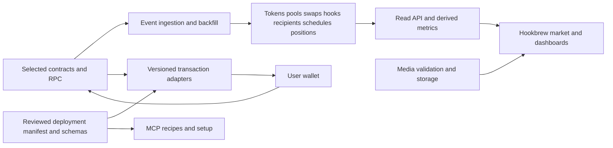

# Hookbrew: reference-site feature audit

Audit date: 17 September 2026. Reference: the public Hooker site, primarily its Arc configuration. Comparison: the current working tree, including uncommitted changes, based on commit `bfbab6a92d9755182cb9d92c772fb8ed06bac521`.

**Hookbrew has a visual identity, responsive glass interface, real wallet/RPC integration, ERC-20 lookup, and a gated basic launch adapter. It does not yet reproduce most of the reference product.** The largest gap is the shared contract/data/transaction infrastructure behind the pages. Another cosmetic pass will not close it.

This audit inventories the public product, its linked workflows, documentation, browser-loaded application code, and advertised MCP interface. It is not a contract security audit or a claim that every Ations, source hashes, and coverage are in [the evidence manifest](evidence/site-audit-2026-09-17.json).

## What was inspected

| Requested surface                      | Inspection performed                                                                                                                                 | Principal gap in Hookbrew                                  |
| -------------------------------------- | ---------------------------------------------------------------------------------------------------------------------------------------------------- | ---------------------------------------------------------- |
| [Market](https://hooker.cash/market)   | Live listings, tiles/list, filters, sorting, quick-buy preferences, linked token pages, mobile layout                                                | Address lookup has replaced the entire indexed market      |
| [Modules](https://hooker.cash/modules) | Registry, launch counts, token drilldown, source-verification panel, linked builder, all eight installable builder cells, custom anti-snipe controls | Static descriptions exist; registry and builder do not     |
| [Agents](https://hooker.cash/agents)   | Setup copy, all seven MCP tool schemas, initialize/list calls, read tools, authentication responses, chain routing, mobile layout                    | No MCP service or client setup exists                      |
| [Docs](https://hooker.cash/docs)       | All ten sections, contract directory, linked guide/FAQs, comparison with current UI and existing contract evidence                                   | Project-status text exists; product documentation does not |

Followed linked flows into `/create`, `/trade`, `/liquidity`, `/leaderboard`, `/artist/<address>`, `/asset/<address>`, `/portfolio`, `/stats`, and `/guide`. The public Terms component and scheduled-launch routing were inspected in the delivered JavaScript. Desktop inspection used 1440×1000; the four requested pages were also captured at 390×844. Public application chunks were parsed as data, not executed outside the browser.

The reference token used for the detailed desk was its published platform token, `0xdf99516d943f8cc285bdc49fee981f60c113e0fe`. Its activity counts changed while history loaded; these are observations, not fixed acceptance numbers.

Evidence labels throughout this audit:

- **Observed:** rendered UI or an actual read response was inspected. A visible button does not establish successful execution.
- **Code/docs:** behavior is described or present in the public client bundle; not exercised end to end.
- **Gated:** requires a wallet, role, agent credential, or funded position. The interface/code was inventoried; signing and protected access were not attempted.
- **Partial locally:** a real foundation exists but the complete user workflow is unavailable.

## Current local implementation

| Area                                        | Authoritative local evidence                                                        | Actual status                                                                                           |
| ------------------------------------------- | ----------------------------------------------------------------------------------- | ------------------------------------------------------------------------------------------------------- |
| Branding/glass/responsive navigation        | `src/components/Glass.jsx`, `Shell.jsx`, `UI.jsx`, `src/index.css`, `public/brand/` | Implemented; preserve this design while adding functionality                                            |
| Chain and token reads                       | `src/config/network.js`, `src/lib/chain.js`, `TokenLookup.jsx`                      | Arc chain/block reads and ERC-20 metadata at a consistent block                                         |
| Wallet                                      | `src/context/WalletContext.jsx`, `WalletDialog.jsx`                                 | Installed-provider discovery, connection, account/network events, switching, native balance             |
| Launch preparation/signing/receipt recovery | `src/lib/launch.js`, `pendingLaunch.js`, `LaunchForm.jsx`                           | Real code for a no-initial-buy launch; deployment configuration is `null`, so unavailable in production |
| Market                                      | `src/pages/MarketPage.jsx`                                                          | Contract-address lookup; no indexed listings or market metrics                                          |
| Modules                                     | `src/pages/ModulesPage.jsx`, `src/data.js`                                          | Nine reference descriptions; no live registry or configurable builder                                   |
| Trade                                       | `src/pages/TradePage.jsx`                                                           | No executable quote; swap button disabled                                                               |
| Other product pages                         | `src/pages/MorePages.jsx`                                                           | Liquidity, rankings and agents are unavailable states; token page is metadata only                      |
| Routes                                      | `src/App.jsx`                                                                       | No asset/artist/portfolio/stats/countdown routes; `/guide` redirects to status docs                     |
| Backend/indexing/media                      | File inventory and `package.json`                                                   | No server, indexer, database, upload service or MCP implementation                                      |

The existing [launch integration report](LAUNCH_INTEGRATION.md) and [contract review](CONTRACT_REVIEW.md) remain relevant. Four original preset hook cores have source/runtime matching evidence, and selected original launch paths have read-only simulations. That is not source coverage of the current factory, policy, builder, module implementations, vesting, fee engine, scheduler, distributor or perps engine. Existing tests exercise wallet/read/basic-launch behavior, not the absent product workflows.

Two immediate UI mismatches: the Modules page's **Open the builder** link goes to a launch-status page, and module-specific `?module=` links are not consumed by `CreatePage`. The global search also accepts arbitrary text but forwards it to address-only lookup.

## Missing product workflows

### Market and discovery

The reference market is an indexed launch feed. It exposes identity/images, creator, venue, hook/fee/quote badges, age, USD and quote prices, market cap, volume, price change, recent activity and sparklines. It has tiles/list modes; live, volume, market-cap and chronological sorting; preset/venue/vesting/new-launch filters; pagination; name/symbol/address search; pins; and configurable quick-buy amounts. These capabilities are absent locally. [Reference market](https://hooker.cash/market).

Pins are also a navigation feature: the delivered shell supports up to eight pinned tokens and drag-to-pin behavior. Quick buy has an explicit preference toggle and amount editor; no buy was submitted. Global activity, autocomplete search and scheduled-launch announcements depend on the same indexed data.

### Registry and hook construction

The registry shows deployment addresses, callback permissions, tier/eligibility, module composition, builder attribution, launch counts and a modal of tokens using each hook. Tabs distinguish all, launchpad and community entries; sorting and module filters refine the list. The verification panel provides compiler instructions and a standard-JSON download. [Reference modules](https://hooker.cash/modules).

Snapshot: 12 displayed registry entries and 43 summed launch counts. **These are not 12 unique contracts or 43 unique tokens.** Presets, custom entries and legacy aliases overlap. The UI builder exposes eight installable cells; the published manifest has ten module-address keys, including two anti-snipe versions and JIT. Hookbrew's nine descriptive cards are a different count again.

| Builder cell   | Observed controls/behavior to implement                                                                                                              |
| -------------- | ---------------------------------------------------------------------------------------------------------------------------------------------------- |
| Bouncer        | Pool-wide buy spacing and a finite launch window; sell exemption described                                                                           |
| Velvet Rope    | Off/Strict/Standard/Light/custom presets; time- or buy-count window; reserve-based opening/final caps, initial hold and ramp duration; curve preview |
| Ticker Tape    | Price-history depth; TWAP/oracle readiness feeds leveraged-market eligibility                                                                        |
| Sugar Daddy    | Quote-side fee allocation to permanent standing support                                                                                              |
| Ashtray        | Fee allocation sent to the burn destination                                                                                                          |
| Money Flip     | Quote-side buyback/burn allocation and maximum price impact                                                                                          |
| Champagne Room | Fee allocation to hook-owned one-sided liquidity; other modes appear in the API schema                                                               |
| Make It Rain   | Quote-side holder reflections; percentage control and preset picks                                                                                   |

JIT is visible in the registry/preset/catalogue/API surfaces, but is not a ninth installable cell in the inspected builder. Model capabilities from the deployed version, rather than hard-coding the gallery count.

The builder also needs aggregate allocation validation, a fee-flow visualization, immutable base economics, encoded module parameters, address prediction, permission-bit-compatible salt mining, reuse of existing deployments, transaction status and registry attribution. An empty composition displayed a reusable existing hook; adding modules changed the predicted artifact. None of this is implemented in Hookbrew. Actual hook deployment remains untested in this scan.

### Launch wizard and scheduled launches

The reference wizard has five stages: pool, hook, token, payouts and review. Missing locally:

- Live quote admission and pricing policy; the inspected Arc UI offered USDC and the platform token. Initial market-cap selection used policy bounds, and fee choices ran from 1% through 5%.
- Curated/custom/community hook selection and builder-to-launch handoff.
- Token image upload/pinning, description and social metadata. The client calls `/api/upload`; the storage provider and server implementation were not inspected.
- Founder purchase with exact quote-token approval and policy cap. Purchased tokens are not a free founder premint; see the prior simulations.
- Recipient splits governing both fee income and purchased tokens; per-recipient vesting overrides. Client validation limits splits to ten wallets, rejects duplicates and caps combined cliff/duration at ten years; deployed policy remains authoritative.
- Cliff/linear/custom vesting, full cost/economics review, and per-stage errors.
- Scheduled launch escrow, countdown, permissionless trigger, cancellation/refund, and the creator's management controls. A datetime input and schedule review were observed; trigger/cancel and countdown routes are code/docs evidence. No schedule was created.
- Vanity-suffix/salt support is present in the delivered client and MCP schema; the normal wizard path did not expose a visible vanity editor during this scan.

The local adapter deliberately implements only configured supply/fee/hooks, name/symbol/description and a no-buy launch, with simulation and strict receipt verification. Extend that foundation rather than replacing it with optimistic UI success. [Reference create flow](https://hooker.cash/create).

### Token desk and spot trading

The reference `/asset/<address>` is a complete trading workspace. Hookbrew's `/token/:id` does not provide its pool/venue resolution, price/liquidity/volume/market-cap metrics, period changes, token dossier, social/share actions or creator detail.

The chart has line/candlestick modes, multiple intervals, zoom/pan, reset and drawing/measurement tools. Below it are a trade timeline with direction/size/time filters, transaction links and pagination; a sortable trader P&L table; and a holder table with balances, ownership share and value. Data arrives progressively, so counts must indicate history coverage rather than imply a complete history prematurely.

Spot execution needs real token selection/import, balances, pool-key resolution, routing, a current executable quote, minimum received/slippage, price impact, approval state, exact settlement, submission tracking and verified outcomes. The public MCP schema describes V4Quoter, Universal Router and Permit2 sequencing. The standalone trade client also contains wrap/unwrap paths for chains where those currencies exist; Arc's USDC path must use its own deployment configuration. [Reference trade](https://hooker.cash/trade), [reference asset](https://hooker.cash/asset/0xdf99516d943f8cc285bdc49fee981f60c113e0fe).

### Fees, holders and vesting

Separate from trading, the token and creator pages expose creator allocation/hold-gate status, accrued token and quote rewards, harvesting, claiming, treasury claims, reflection totals/distribution and vesting progress/releases. Module metrics include burn-destination holdings and deepened/floor liquidity. The client contains `harvest`, `claim`, `claimTreasury`, `distribute`, vesting getters and claim methods.

This requires recipient-aware accounting, eligibility explanations, permissionless keeper operations and receipt-backed updates. A connected wallet balance alone does not implement any of these flows. The inspected holder-distribution button showed an accrued amount, but was not clicked.

### Liquidity, identities and portfolio

The liquidity page has indexed pools, pair/fee data, search, fee filters and sort controls. The delivered client contains pool initialization, approvals and PositionManager liquidity writes. **All sampled Arc USDC Add LP actions were disabled** with an ETH-only limitation. Do not treat the reference's generic LP documentation as proof of working Arc LP execution. Track LP deposit, position discovery, fee collection and withdrawal as a deployment-specific verification task; the full position-management lifecycle was not demonstrated in this scan. [Reference liquidity](https://hooker.cash/liquidity).

The leaderboard separates token creators from hook builders and includes rankings, filter/sort controls, aggregate activity, notable launches and profile links. Profiles show badges, launch history, built hooks and creator-specific reward code paths. Portfolio has a disconnected wallet gate; its client implements priced balances, total portfolio value, token import and removal. Claims are associated with token/creator surfaces, not assumed to exist in Portfolio. Stats is a separate route for launch/creator counts and fee-share/volume aggregates. All are missing locally. [Leaderboard](https://hooker.cash/leaderboard), [portfolio](https://hooker.cash/portfolio), [stats](https://hooker.cash/stats).

### Leveraged trading and vault

This is an additional product system, not an alternate spot-swap label. The platform-token desk rendered long/short choices, leverage presets, a TWAP mark, liquidation estimate, pool open interest, depth-based limits and a vault tab. Vault assets and backing controls were observed without a wallet. Public code contains permissionless market activation, position open/close, margin addition, vault backing/withdrawal, share accounting and funding-aware position health.

A matching perps engine, oracle history, indexed markets/positions, margin/solvency calculations and liquidation/keeper behavior would be required for full parity. Contract execution, liquidation and vault withdrawal were not tested. Builder copy still describes perps as forthcoming, despite the visible desk. Keep this as a separate later milestone with its own contract review and invariants; do not count it as delivered when spot swaps work.

### Agent service and documentation

The advertised MCP server identifies as `launchpad-mcp` 2.3.0 and lists seven tools:

| Tool                 | Capability Hookbrew lacks                                              |
| -------------------- | ---------------------------------------------------------------------- |
| `get_launchpad_info` | Chain/deployment/constants/quote/preset discovery                      |
| `list_launches`      | Event-query recipe with factory/version coverage                       |
| `get_token`          | Metadata, venue, hook manifest, creator and vesting read recipe        |
| `prepare_launch`     | Launch policy, funding, metadata, splits, vesting and scheduler recipe |
| `prepare_build_hook` | Module encoding, deterministic address and salt/build recipe           |
| `prepare_trade`      | Quote/routing, slippage, Permit2 and settlement recipe                 |
| `prepare_collect`    | Harvest and recipient claim recipe                                     |

The stated design returns ABIs and recipes; agents run their own RPC calls and sign with their own wallets. It is not evidence of a server-side execution bot. Our page currently has no endpoint, schemas, authentication lifecycle, chain routing, setup snippets, examples or integration tests. [Reference agents](https://hooker.cash/agents).

Product docs must explain the actual selected deployment: launch policy and quote units, pool/hook/module mechanics, fee and hold-gate accounting, recipient splits, vesting, execution failures, liquidity custody, contract/version directory, agent setup and FAQs. The current status page should remain useful as a status page, alongside real documentation and a guide. [Reference docs](https://hooker.cash/docs), [guide](https://hooker.cash/guide).

## Shared technical foundation we are missing

The reference browser uses a GraphQL indexer proxy and JSON endpoints for live activity, holders and quotes. The observed `/api/indexer-arc/live` response is **JSON**, not evidence of an SSE stream. The MCP endpoint separately returned `text/event-stream` protocol responses.

Observed GraphQL operations include launch discovery, hook rows, token metadata/state/statistics, pool trades, spark samples, batched feed volumes, creator activity/status, module totals, platform stats and perps surfaces. Public scheduled-launch code adds another indexed entity. These are independent requirements even if the final backend combines them.

Recommended Hookbrew architecture, inferred from these responsibilities:

Implement chain-qualified identifiers, deployment-block backfill, log deduplication, reorg handling, checkpoint/retry logic, decimal-safe arithmetic, quote-to-USD provenance, freshness/error states, pagination and cache invalidation. These are engineering requirements inferred for reliable parity; the audit did not inspect the reference's private backend implementation. No evidence establishes which database or hosting service it uses.

The contract boundary is broader than a factory address: policy, token deployer, hook/module registries, builder, fee engine, seed executor, vesting, distributor, scheduler, V4 PoolManager/StateView/Quoter/PositionManager/Universal Router/Permit2, quote assets and optional perps engine. Establish deployment versions and authority/fee recipients explicitly. Rebranding a client does not change the original treasury.

## Reference inconsistencies to correct, not reproduce

| Finding                                                                   | Evidence                                                                                                                                                   | Implication                                                                                          |
| ------------------------------------------------------------------------- | ---------------------------------------------------------------------------------------------------------------------------------------------------------- | ---------------------------------------------------------------------------------------------------- |
| MCP ignores the requested Arc selection in tested discovery calls         | `?chain=5042`, `x-chain-id: 5042`, and both together returned chain **4663**, Robinhood; 4663 control also returned 4663                                   | Cross-chain recipes need validated routing and a fail-closed mismatch check                          |
| Advertised credential-free setup conflicts with action tools              | All four `prepare_*` tool names returned JWT-required errors; public disconnected Agents page has no grant flow                                            | Decide and document real auth behavior; HTTP 200 with `isError: true` is a failure                   |
| ETH/WETH copy leaks into Arc                                              | Docs, guide, scheduler and portfolio copy conflict with Arc's USDC configuration; the observed launch review says 1 USDC                                   | Derive currency names, decimals and fees from chain/configuration                                    |
| Generic LP claims exceed the Arc interface                                | Sampled USDC pool Add LP controls disabled with an ETH-only explanation                                                                                    | Do not advertise unsupported liquidity actions                                                       |
| Preset labels/counts are not canonical identities                         | Legacy Anti-Snipe labels alias preset addresses; Reflect 40+Burn20 wording conflicts with the 50% description/configuration; registry entries overlap      | Read manifests and deduplicate by chain/address/version                                              |
| Verification-kit compiler guidance conflicts with the verified core build | UI displays `v0.8.26+commit.4593bcf0`; retained core build uses `0.8.26+commit.8a97fa7a`                                                                   | Generate instructions from exact build metadata and verify the download against the deployed version |
| Reviewed/verified/permissionless claims have narrower evidence            | Docs claim broad verification; the verification panel says custom hooks require manual verification; current implementations are not all available locally | Display evidence per contract/version; do not transfer blanket security claims                       |
| Burn wording can confuse circulating supply with ERC-20 totalSupply       | Recovered plain token has fixed constructor supply; burn-destination transfers do not themselves reduce reported totalSupply                               | Show burned/circulating/total-supply measures distinctly                                             |
| Perps launch-stage copy is inconsistent                                   | Builder calls perps future-facing; token desk currently renders perps and vault surfaces                                                                   | Keep capability flags and docs tied to deployed features                                             |

The scheduler's default time also immediately displayed a below-minimum warning after minute rounding. Record this as a UI observation, not a proven contract defect. Failed automation selectors were corrected or marked unverified; they are not counted as product bugs.

## Delivery order and completion standard

1. **Foundation:** settle the deployment/version boundary; build event ingestion, media metadata and a read API. Build read-only market/token/profile views in parallel with contract-source work.
2. **Core product loop:** complete pool/hook/token/payout/review launch flow, then indexed launch discovery, a token desk and real spot execution. Preserve the existing preflight/receipt/recovery work.
3. **Programmable tokenomics:** registry and builder, module parameter validation, fee harvest/claims, holder distributions and vesting. Add source-verification artifacts.
4. **Management and integrations:** scheduling/refunds, portfolio, creator rankings, stats, supported LP paths, complete docs and MCP.
5. **Advanced parity:** quick-buy ergonomics, full chart tooling, additional chain configurations and leveraged markets/vaults. These remain in scope; they are not prerequisites for the first working spot launchpad.

Every feature needs UI **and** its data/contract path. For the core loop, acceptance means: configure a reviewed deployment; prepare/approve/sign once; verify the actual launch receipt; index it; show the correct pool/token; quote and execute a real swap in an authorized validation environment; update balances/history; and correctly handle rejection, revert, stale data, wrong chain and reload. Fixture tests alone do not establish deployed parity.

## Scope limits

No wallet was connected or impersonated for this scan; no token, hook, schedule, trade, claim, LP or perps transaction was submitted. No protected indexer credential was extracted or reused. MCP action recipes remained authentication-gated. Private backend source and wallet-specific balances/positions are outside publicly observable evidence. No missing workflow is marked implemented just because its ABI, label or button exists.

This completes the public-site gap analysis, not the Hookbrew implementation. The separate deployment choice remains necessary for enabling transactions; it did not prevent this audit or the read-only work identified above.
